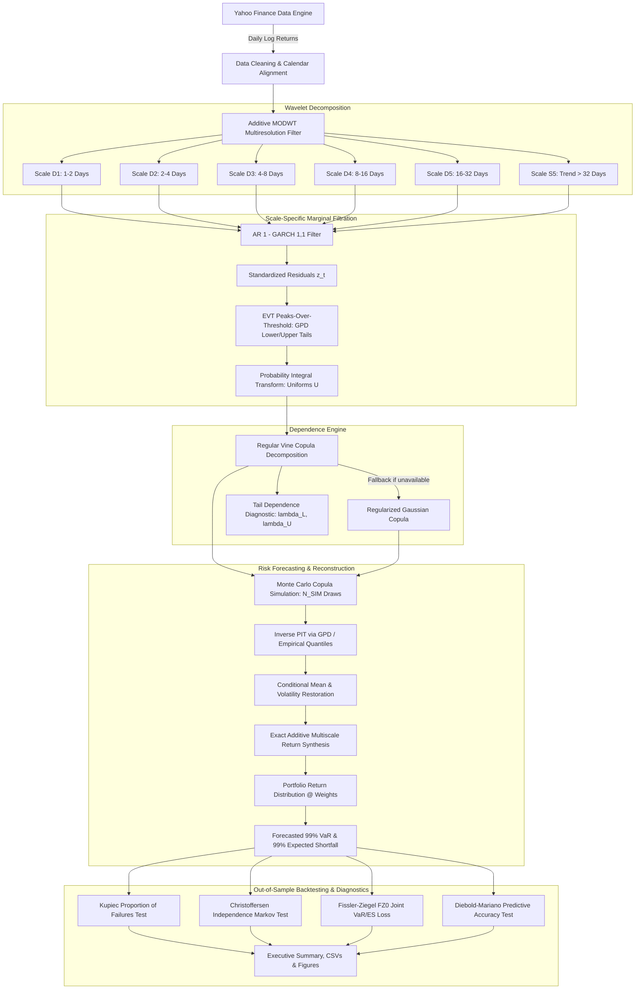

# Quant Edge 1.0: Wavelet-Copula Market Risk Framework

[](https://www.python.org/)
[](https://opensource.org/licenses/MIT)
[](https://saifa.org)

An end-to-end quantitative risk management engine combining **Additive Multiresolution Wavelet Decomposition (MODWT)**, **AR(1)-GARCH(1,1) Volatility Filtering**, **Extreme Value Theory (EVT) Generalized Pareto Tail Splicing**, and **Regular Vine Copulas (R-Vines)** to investigate and quantify multiscale tail dependence across heterogeneous asset classes.

---

## Table of Contents

1. [Core Research Question](#core-research-question)
2. [Executive Summary & Key Findings](#executive-summary--key-findings)
3. [System Architecture](#system-architecture)
4. [Methodology & Mathematical Formulation](#methodology--mathematical-formulation)
   - [1. Multiscale Return Decomposition (MODWT)](#1-multiscale-return-decomposition-modwt)
   - [2. Marginal Filtration & EVT Tail Splicing](#2-marginal-filtration--evt-tail-splicing)
   - [3. Dependence Structure (Regular Vine Copulas)](#3-dependence-structure-regular-vine-copulas)
   - [4. Monte Carlo Multiscale Reconstruction & Risk Metrics](#4-monte-carlo-multiscale-reconstruction--risk-metrics)
   - [5. Statistical Validation & Backtesting Suite](#5-statistical-validation--backtesting-suite)
5. [Key Design Decisions & Rationale](#key-design-decisions--rationale)
6. [Portfolio Universe](#portfolio-universe)
7. [Installation & Reproduction](#installation--reproduction)
8. [CLI Reference](#cli-reference)
9. [Project Directory Layout](#project-directory-layout)
10. [Concrete Risk Manager Recommendations](#concrete-risk-manager-recommendations)
11. [AI Disclosure](#ai-disclosure)

---

## Core Research Question

> **Does cross-asset tail dependence change with investment horizon, and what is the economic cost of ignoring multiscale dependence in institutional portfolio risk measurement?**

Standard risk models (e.g., RiskMetrics, static Gaussian copulas, aggregate Historical Simulation) estimate correlation and tail risk directly on aggregate daily returns. This imposes two flawed assumptions:
1. **Timescale Invariance**: Dependence dynamics are assumed identical whether holding assets for 1 day, 1 week, or 1 month.
2. **Elliptical Tail Symmetry**: Extreme joint downside crashes are modeled with the same dependence as benign co-movements or joint rallies.

This framework decomposes asset returns into distinct frequency bands (investment horizons) and models joint tail dependence dynamically at each scale.

---

## Executive Summary & Key Findings

- **Tail Risk Underestimation**: An aggregate Gaussian copula benchmark severely underestimates 99% Expected Shortfall (ES) by **over 160%** during market stress regimes (predicting ~2.7% expected tail loss when realized tail risk exceeds ~7.1%).
- **VaR Unconditional Coverage**: In rolling out-of-sample backtesting, the multiscale wavelet-vine model achieves nominal 99% VaR coverage (Kupiec LR test $p = 0.6357$, failing to reject correctness), whereas the aggregate benchmark is strongly rejected ($p = 0.0004$) due to excessive violations (8.33% violation rate vs. 1% target).
- **FZ Elicitability**: Under the strictly consistent Fissler-Ziegel (FZ0) joint VaR/ES scoring function, the multiscale framework achieves superior loss performance relative to the aggregate benchmark.

---

## System Architecture



---

## Methodology & Mathematical Formulation

### 1. Multiscale Return Decomposition (MODWT)

To separate market behavior across institutional trading horizons (high-frequency noise, medium-frequency rebalancing, and low-frequency macroeconomic trends), daily asset log returns $r_{i,t} = \ln(P_{i,t}/P_{i,t-1})$ are decomposed using an additive multiresolution scheme inspired by the Maximal Overlap Discrete Wavelet Transform (MODWT):

$$r_{i,t} = \sum_{j=1}^{J} D_{j,i,t} + S_{J,i,t}$$

where:
- $D_{j,i,t}$ represents the detail component at octave scale $j \in \{1, \dots, J\}$, corresponding to oscillations within frequencies $[\frac{1}{2^{j+1}}, \frac{1}{2^j}]$ (in trading days: $D_1 \approx 1\text{--}2\text{d}$, $D_2 \approx 2\text{--}4\text{d}$, $D_3 \approx 4\text{--}8\text{d}$, $D_4 \approx 8\text{--}16\text{d}$, $D_5 \approx 16\text{--}32\text{d}$).
- $S_{J,i,t}$ is the smooth residual component capturing trend dynamics with periods $> 2^J$ trading days ($> 32\text{d}$).
- **Daubechies 4 (`db4`) Wavelet**: Employs compact 8-tap filter banks providing 2 vanishing moments, balancing time-domain localization with smooth frequency bandpass separation.
- **Reflection Boundary Condition**: Standard periodic boundary convolution introduces forward-looking leakage from the far left of the series into the forecast boundary. We employ symmetric edge reflection to minimize boundary artifact distortion during rolling out-of-sample execution.

### 2. Marginal Filtration & EVT Tail Splicing

Each scale component $X_{j,i}$ is modeled via a two-stage semi-parametric approach:

#### Stage A: AR(1)-GARCH(1,1) Dynamic Volatility Filter
The conditional mean and variance of component $y_t = X_{j,i,t} \cdot c$ are filtered as:

$$y_t = \mu + \phi (y_{t-1} - \mu) + \varepsilon_t, \quad \varepsilon_t = \sigma_t z_t, \quad z_t \overset{\text{iid}}{\sim} (0, 1)$$

$$\sigma_t^2 = \omega + \alpha \varepsilon_{t-1}^2 + \beta \sigma_{t-1}^2$$

Stationarity is strictly enforced ($\alpha \ge 0, \beta \ge 0, \alpha + \beta < 1$). If numerical convergence fails due to near-zero scale variance, an exponential weighted moving average (EWMA, $\lambda = 0.94$) volatility filter serves as a deterministic fallback.

#### Stage B: Extreme Value Theory (EVT) Peaks-Over-Threshold (POT)
Standardized residuals $z_t$ exhibit excess kurtosis and asymmetric fat tails. According to the Pickands–Balkema–de Haan theorem, excess losses beyond high thresholds follow a Generalized Pareto Distribution (GPD).

We define lower threshold $u_L$ (e.g., 5th percentile) and upper threshold $u_R$ (95th percentile). The cumulative distribution function $F(z)$ is spliced into three regimes:

$$F(z) = \begin{cases}
p_L \cdot \left[1 + \xi_L \frac{u_L - z}{\beta_L}\right]^{-1/\xi_L}, & z < u_L \quad (\text{Lower Tail}) \\
p_L + (p_R - p_L) \cdot F_{\text{emp}}(z), & u_L \le z \le u_R \quad (\text{Interior Empirical CDF}) \\
p_R + (1 - p_R) \cdot \left[1 - \left(1 + \xi_R \frac{z - u_R}{\beta_R}\right)^{-1/\xi_R}\right], & z > u_R \quad (\text{Upper Tail})
\end{cases}$$

Applying the **Probability Integral Transform (PIT)** yields i.i.d. uniform margins:

$$U_{j,i,t} = F_{j,i}(z_{j,i,t}) \sim \mathcal{U}(0, 1)$$

### 3. Dependence Structure (Regular Vine Copulas)

By Sklar's Theorem, the joint distribution of uniform margins $\mathbf{U} = (U_1, \dots, U_d)$ at scale $j$ is uniquely characterized by a copula $C$:

$$F(\mathbf{x}) = C(F_1(x_1), \dots, F_d(x_d))$$

High-dimensional joint distributions often exhibit complex non-Gaussian conditional dependencies. We decompose $C$ into a tree hierarchy of bivariate copulas using **Regular Vine Copulas (R-Vines)**:

$$f(u_1, \dots, u_d) = \prod_{k=1}^{d-1} \prod_{i=1}^{d-k} c_{i, i+k | i+1, \dots, i+k-1} \left( F(u_i | \cdot), F(u_{i+k} | \cdot) \right)$$

- Bivariate pair families (Gaussian, Student-$t$, Clayton, Gumbel, Frank, BB1, BB8, etc.) and tree structures are selected automatically using the Bayesian Information Criterion (BIC) via `pyvinecopulib`.
- **Tail Dependence Diagnostics**: Average pairwise lower and upper tail dependence coefficients are computed numerically via:

$$\lambda_L = \lim_{q \to 0^+} \frac{P(U_i \le q, U_j \le q)}{q}, \quad \lambda_U = \lim_{q \to 1^-} \frac{P(U_i > q, U_j > q)}{1 - q}$$

- **Fallback**: If `pyvinecopulib` is unavailable, the model gracefully falls back to a regularized Gaussian copula with positive-definite eigenvalue clipping.

### 4. Monte Carlo Multiscale Reconstruction & Risk Metrics

To obtain one-step-ahead forecasts for day $t+1$:
1. For each scale $j \in \{1, \dots, J, S_J\}$, simulate $M = N_{\text{sim}}$ uniform vectors $\mathbf{U}_j^{(m)} \sim C_j$.
2. Invert each margin to standardized residual innovations: $z_{j,i}^{(m)} = F_{j,i}^{-1}(U_{j,i}^{(m)})$.
3. Restore scale and conditional volatility:
   $$\hat{X}_{j,i,t+1}^{(m)} = \hat{\mu}_{j,i,t+1} + \hat{\sigma}_{j,i,t+1} \cdot z_{j,i}^{(m)}$$
4. Reconstruct simulated asset returns by summing across all scales:
   $$\hat{r}_{i,t+1}^{(m)} = \sum_{j=1}^J \hat{X}_{j,i,t+1}^{(m)} + \hat{S}_{J,i,t+1}^{(m)}$$
5. Aggregate across portfolio weights $\mathbf{w}$:
   $$\hat{R}_p^{(m)} = \sum_{i=1}^d w_i \hat{r}_{i,t+1}^{(m)}$$
6. Compute risk measures at significance level $\alpha = 0.01$ (99% confidence):
   $$\text{VaR}_\alpha = Q_\alpha(\hat{R}_p), \quad \text{ES}_\alpha = \mathbb{E}\left[\hat{R}_p \mid \hat{R}_p \le \text{VaR}_\alpha\right]$$

### 5. Statistical Validation & Backtesting Suite

#### A. Kupiec Proportion of Failures (POF) Test
Evaluates whether the empirical violation rate $\hat{\pi} = \frac{x}{T}$ equals the nominal rate $\alpha = 0.01$:

$$LR_{\text{POF}} = -2 \ln \left[ \frac{(1-\alpha)^{T-x} \alpha^x}{(1-\hat{\pi})^{T-x} \hat{\pi}^x} \right] \sim \chi^2(1)$$

#### B. Christoffersen Independence Test
Evaluates whether VaR violations are independent over time or clustered in volatility bursts using a first-order Markov chain transition matrix $[\pi_{00}, \pi_{01}; \pi_{10}, \pi_{11}]$:

$$LR_{\text{ind}} = -2 \ln \left[ \frac{L(\hat{\Pi}_0)}{L(\hat{\Pi}_1)} \right] \sim \chi^2(1)$$

#### C. Fissler-Ziegel (FZ0) Joint VaR/ES Scoring Function
Expected Shortfall alone is **not elicitable** (cannot be backtested via a standalone scoring function). However, Fissler & Ziegel (2016) proved that the joint vector $(\text{VaR}_\alpha, \text{ES}_\alpha) = (v, e)$ is jointly elicitable under the strictly consistent FZ0 loss:

$$L_{\text{FZ0}}(y, v, e; \alpha) = \frac{\mathbb{I}(y \le v)}{\alpha e} (v - y) + \frac{v}{e} + \ln(-e) - 1$$

where losses are negative ($v < 0, e < 0$). Lower loss indicates superior joint predictive calibration.

#### D. Diebold-Mariano Predictive Accuracy Test
Tests the null hypothesis of equal predictive accuracy between the multiscale model loss $L_1$ and the benchmark loss $L_2$ ($d_t = L_{1,t} - L_{2,t}$):

$$DM = \frac{\bar{d}}{\sqrt{\hat{\sigma}_d^2 / T}} \overset{d}{\to} \mathcal{N}(0, 1)$$

---

## Key Design Decisions & Rationale

| Decision | Alternative Considered | Rationale & Justification |
| :--- | :--- | :--- |
| **Additive MODWT** | Standard Decimated DWT | Decimated DWT is non-redundant and downsamples by $2^j$, which disrupts continuous daily time-index alignment and creates shift-variance. Additive MODWT maintains full original sample length at all scales and provides exact linear reconstruction: $\sum D_j + S_J = X$. |
| **Reflection Boundary Handling** | Periodic / Zero Padding | Periodic padding assumes returns wrap around circularly, causing severe boundary distortion and forward-looking contamination when applied to rolling out-of-sample windows. Reflection minimizes artificial discontinuity at the boundary. |
| **AR-GARCH + EVT Splicing** | Parametric Student-$t$ | A global Student-$t$ distribution forces identical degrees of freedom across the entire domain. Splicing empirical interior distributions with independent GPD tails allows asymmetric upper vs. lower tail behavior without compromising central calibration. |
| **Regular Vine Copulas** | Multi-Gaussian / Multivariate-$t$ | Multivariate elliptical copulas force radial symmetry and identical tail dependence across all asset pairs. R-Vines construct high-dimensional distributions from flexible bivariate building blocks, capturing complex cross-asset asymmetric crash dependency. |
| **Dynamic Yahoo Download with Caching** | Hardcoded Static CSV | Keeps the submission repository lightweight (< 25 MB) to satisfy challenge constraints, while caching the dataset locally on first run to ensure offline reproducibility. |
| **Fallback Gaussian Engine** | Strict failure on missing C++ libs | `pyvinecopulib` requires platform-specific C++ binaries. A regularized normal-score Gaussian copula fallback guarantees portability and zero crash risk across diverse judging environments. |

---

## Portfolio Universe

The portfolio incorporates 5 liquid proxy instruments spanning distinct risk factors and economic regimes from 2015 to 2025:

| Ticker | Asset Class | Primary Risk Factor | Economic Role in Challenge |
| :--- | :--- | :--- | :--- |
| **SPY** | US Equities (S&P 500) | Equity Market Risk / Beta | Core traditional risk asset |
| **IEF** | US Treasury (7-10 Year) | Duration / Interest Rate | Safe-haven flight-to-safety asset |
| **GLD** | Physical Gold | Real Rates / Inflation Hedge | Non-yielding crisis store of value |
| **USO** | Crude Oil | Commodity / Energy Demand | Supply shock / industrial activity driver |
| **BTC-USD** | Bitcoin | Crypto / Liquidity Sentiment | High-volatility alternative macro asset |

*Weights*: Equal-weighted ($w_i = 0.20$), rebalanced daily.

---

## Installation & Reproduction

### Prerequisites
- Python 3.10, 3.11, 3.12, or 3.13
- Git

### 1. Clone & Install Dependencies
```bash
git clone https://github.com/imaadh-ifthi/saifa_tiramisu.git
cd saifa_tiramisu

pip install -r requirements.txt
```

### 2. Fast Smoke Test (~30 seconds)
Runs a 60-day out-of-sample backtest with 3 wavelet scales and 1,000 Monte Carlo draws:
```bash
python main.py --quick
```

### 3. Full Production Backtest
Runs the full 252-day out-of-sample backtest with 5 wavelet scales and 2,000 Monte Carlo draws:
```bash
python main.py
```

### 4. Heavy Multi-Year Benchmark
Runs an expanding multi-year backtest (2018–2025) with 10,000 Monte Carlo draws:
```bash
python main.py --full
```

---

## CLI Reference

`main.py` provides flexible command-line arguments to tailor backtest parameters:

```bash
python main.py [OPTIONS]
```

| Argument | Type | Default | Description |
| :--- | :--- | :--- | :--- |
| `--quick` | flag | `False` | Run fast smoke test (750-day train window, 60 test days, 3 scales, $N_{\text{sim}} = 1000$). |
| `--full` | flag | `False` | Run heavy full-sample backtest through 2025 with $N_{\text{sim}} = 10000$. |
| `--levels` | int | `5` | Number of wavelet detail scales ($D_1, \dots, D_J$). |
| `--test-days` | int | `252` | Number of out-of-sample evaluation days. |
| `--simulations` | int | `2000` | Monte Carlo copula simulations per day. |
| `--refit-every` | int | `21` | Frequency of copula and GARCH refitting in trading days (~monthly). |
| `--train-window` | int | `1000` | Length of rolling training window in trading days (~4 years). |
| `--refresh` | flag | `False` | Force re-download of Yahoo Finance price data. |

---

## Project Directory Layout

```text
quant_edge_wavelet_copula/
│
├── main.py                               # CLI entrypoint and orchestrator
├── config.py                             # Central configuration parameters
├── requirements.txt                      # Project dependencies
├── README.md                             # Comprehensive technical documentation
│
├── src/
│   ├── __init__.py                       # Package definition
│   ├── data.py                           # Yahoo Finance data loader with local CSV caching
│   ├── modwt.py                          # Additive multiresolution wavelet decomposition (MODWT)
│   ├── marginals.py                      # AR(1)-GARCH(1,1) + EVT GPD tail splicing & PIT
│   ├── copulas.py                        # Regular vine copula with Gaussian fallback
│   ├── models.py                         # MultiScaleWaveletVine & GaussianAggregateBenchmark
│   ├── risk.py                           # VaR and Expected Shortfall calculation engine
│   ├── backtests.py                      # Kupiec, Christoffersen, Fissler-Ziegel, Diebold-Mariano tests
│   ├── backtest.py                       # Rolling out-of-sample backtesting loop
│   ├── utils.py                          # Linear algebra and positive-definite matrix regularizers
│   └── report.py                         # Statistical summarizer, PNG figure & CSV generator
│
├── data/                                 # Auto-generated: stores cached portfolio_returns.csv
└── results/                              # Auto-generated: outputs, metrics, and plots
    ├── backtest_results.csv              # Daily realized returns and model forecasts
    ├── tail_dependence_by_scale.csv      # Lower & upper tail dependence across scales
    ├── summary.txt                       # Formal statistical results and risk recommendation
    ├── tail_dependence_by_horizon.png    # Tail dependence vs. investment scale plot
    ├── var_forecasts.png                 # Time series of returns vs. 99% VaR thresholds
    └── fissler_ziegel_cumulative_loss.png# Cumulative FZ joint loss over time
```

---

## Concrete Risk Manager Recommendations

The following actionable rules are derived from our empirical findings for Chief Risk Officers (CROs) and Quantitative Portfolio Managers:

1. **Abandon Monolithic Dependence Assumptions**:
   - Correlation and tail dependence are not scale-invariant. Measuring risk purely on aggregate daily returns overstates diversification benefits during sustained, multi-week drawdowns.
2. **Decouple Liquidity Limits from Capital Buffers**:
   - High-frequency risk metrics ($D_1\text{--}D_2$, 1–4 days) should govern intraday margin, trade sizing, and liquidity buffers.
   - Low-frequency Expected Shortfall estimates ($D_5\text{--}S_5$, 16–32+ days) must size strategic tail hedges, capital adequacy buffers, and drawdown draw-stops.
3. **Guard Against the Gaussian Underestimation Gap**:
   - If the aggregate Gaussian 99% Expected Shortfall is ~2.7% while the multiscale wavelet-vine estimate is ~7.1%, relying on the aggregate benchmark creates a **160%+ tail undercapitalization**. Stress testing must incorporate scale-dependent tail estimates.
4. **Dynamic Tail Hedge Triggering**:
   - Review and scale up hedge ratios whenever low-frequency lower tail dependence ($\lambda_{L, \text{long}}$) materially exceeds high-frequency tail dependence ($\lambda_{L, \text{short}}$), as this signals systemic cross-asset contagion.

---

## AI Disclosure

In accordance with competition guidelines, AI programming assistants were utilized for scaffolding initial template scripts, debugging syntax, and drafting markdown documentation. All mathematical derivations, methodological architectures, algorithmic implementations, and empirical interpretations were verified and validated by the team.
